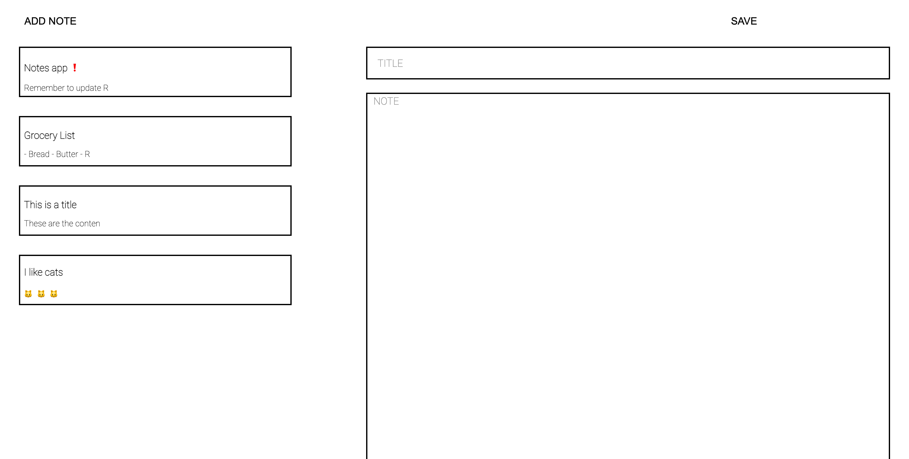

# Note-Taking App

This is a front-end web app which allows users to write and save notes. It was created in response to Makers Academy's Week 7 Afternoon Challenge, and built using HTML, CSS, and vanilla JS.

The team: @Emmapr123, @cspoppuppy, @mstrivens and @inbarvernia

## Features
- Users can create a new note, with title and content
- A list of existing notes displays their full titles and previews showing the first 20 characters of their contents
- Users can view, edit, and delete existing notes
- Users can use emoji shortcodes like `:cat:` that get converted into emojis like 🐱 as they type (using calls to an external API at https://makers-emojify.herokuapp.com)
- State is maintained by saving notes to local storage, so that the notes persist even after refreshing the page, or closing and opening the browser
- A basic testing framework for unit tests, created ourselves, can be accessed through a separate `html` file

### How to Use
1. Clone this repo locally using `git clone`
2. Open `index.html` in a web browser
3. Click on 'ADD NOTE' to get started writing notes
4. Click 'SAVE' to save the contents of your note; a preview of the note will then be displayed on the left of the page
5. Click on any note from the list on the left to display its full content
6. When a note is being displayed, change the text and click on 'SAVE' to edit it, or click on 'DELETE' to remove it

#### To run the tests
1. Open `testing.html` in a web browser
2. Open the browser console; test description will be displayed in the console, followed by `pass` or `fail` (currently all tests are passing)
